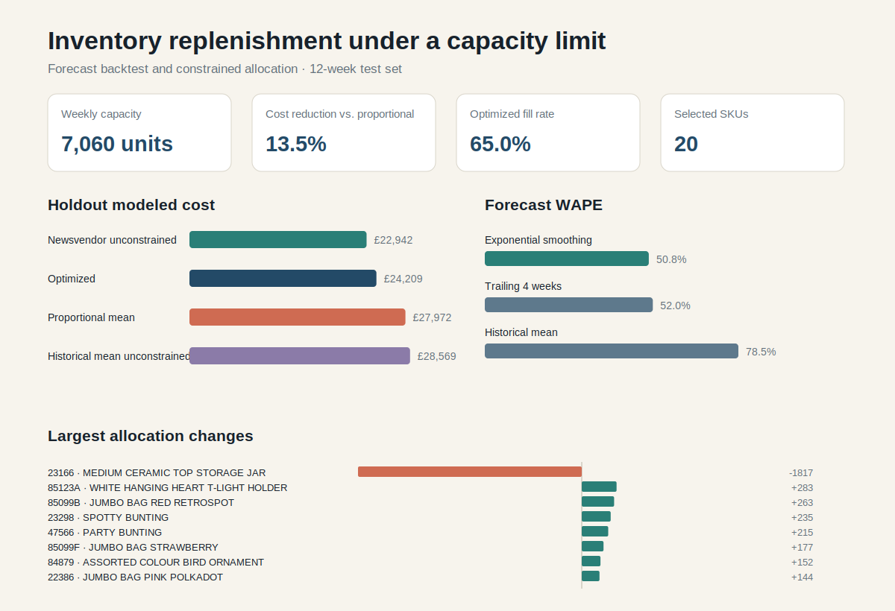

# Inventory Under Constraint

This project turns real retail transactions into a weekly replenishment decision:

> When inventory capacity is limited, which products should receive the next unit,
> and what service/cost tradeoff does that decision create?

It cleans one year of UCI Online Retail II transactions, selects recurring products using
training data only, backtests three simple forecast baselines, and solves a capacity-constrained
empirical newsvendor problem. The final outputs are a policy comparison, SKU-level allocation,
SQLite analysis database, visual summary, and an evidence-bounded decision report.



## Result snapshot

On the final 12 held-out weeks, the capacity-constrained optimizer reduced scenario cost
by **13.5%** relative to proportional mean allocation while raising fill rate from **56.7%**
to **65.0%**, using the same 7,060-unit weekly capacity.

The largest reallocation exposes a practical failure mode in mean-based planning. One SKU
contains a single 74,215-unit training week while its typical positive week is about 82 units.
The proportional baseline reserves 1,899 units every week; the empirical optimizer assigns 82.
The right operational response is not to erase the event, but to determine whether it was a
known wholesale order or a data-quality problem and route it outside routine replenishment.

Full interpretation and assumptions: [exports/insight_report.md](exports/insight_report.md).

## Decision model

For each SKU, the model minimizes expected weekly overage and underage cost:

`min Σ hᵢ E[(qᵢ-Dᵢ)⁺] + pᵢ E[(Dᵢ-qᵢ)⁺]`

subject to a shared integer capacity: `Σ qᵢ ≤ C`.

Each empirical SKU cost curve is discrete convex, so the constrained solution is built by
assigning the next unit wherever it creates the greatest marginal expected-cost reduction.
The test suite checks this optimizer against brute-force enumeration on a small instance.

## Reproduce

```bash
python3 -m venv .venv
source .venv/bin/activate
pip install -r requirements.txt
make data
make test
make analyze
```

The raw 43.5 MB workbook is downloaded from UCI and ignored by Git. The generated CSV,
Markdown, SVG, and SQL-query files are small and reviewable. `exports/replenishment.db` is
also generated locally and ignored.

## Outputs

- `exports/insight_report.md` - findings, policy comparison, assumptions, and next questions
- `exports/decision_summary.svg` - compact visual of costs, forecasts, and reallocations
- `exports/policy_comparison.csv` - holdout policy metrics
- `exports/sku_decisions.csv` - SKU demand statistics and allocation decisions
- `exports/forecast_metrics.csv` - chronological 12-week forecast backtest
- `exports/qa_summary.md` - explicit source, exclusion, split, and selection counts
- `exports/replenishment.db` - generated SQLite database for independent analysis
- `sql/analysis_queries.sql` - human-readable queries against the generated database

## Evidence boundaries

This is a decision lab, not a production inventory recommendation. UCI provides selling price
but not procurement cost, lead time, margin, case-pack size, shelf life, or service commitments.
Holding and shortage costs are therefore explicit scenario assumptions. Returns and cancellations
are excluded from positive demand and reported separately rather than silently netted against sales.

## Data attribution

Daqing Chen (2012), *Online Retail II*, UCI Machine Learning Repository.
[DOI 10.24432/C5CG6D](https://doi.org/10.24432/C5CG6D). The dataset is licensed CC BY 4.0.
