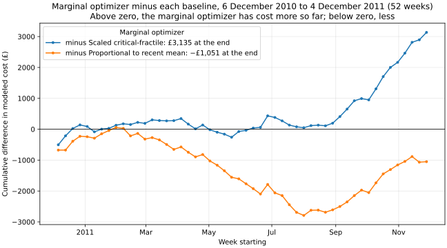

# Inventory replenishment under a capacity limit: results

Over the 52 evaluation weeks, 6 December 2010 to 4 December 2011, the marginal optimizer's modeled cost was 4.0% higher than the scaled critical-fractile rule's (95% interval 0.6% to 8.3% higher; it cost less in 20 of the 52 weeks and more in 32). Against proportional allocation, there was no clear difference: 1.3% lower in total (95% interval from 4.9% lower to 3.3% higher; it cost less in 27 of the 52 weeks and more in 25). The lowest modeled cost within the limit was the scaled critical-fractile rule's (£77,909); the unconstrained newsvendor, which ignores the limit, came to £76,403.

## What was compared

The study follows 20 products sold in the United Kingdom through 52 weeks, from 6 December 2010 to 4 December 2011. At the start of every week each policy chooses how many units of each product to hold, using only the sales and prices recorded before that week began. Units left at the end of a week are carried into the next week, and sales beyond the units on hand are lost. Replenishment arrives at once (zero lead time).

Total stock at the start of a week may not exceed 6,455 units. This is a hypothetical storage limit, counted in units because the data has no product sizes. It equals the cohort's mean weekly sales (6,455.3 units) over the 51 weeks with invoices in the selection year (7 December 2009 to 5 December 2010), rounded to a whole unit. The products are the 20 with the highest revenue that year among those sold in at least 26 of its 52 weeks. The cohort and the limit were fixed before the first evaluation week and are the same for every policy and every scenario, except that the capacity sensitivities apply their own factor to the same mean.

Sales means invoiced merchandise units after removing orders that the same customer reversed with an equal credit within 24 hours. It stands in for the sales that stock could have covered. The data report, [data_quality.md](data_quality.md), shows how every source line was classified.

## Cost model

Each week costs, for every product, a holding charge on the units left over and a shortage charge on the sales not covered, both in proportion to the product's price. The holding rate h is 5.0% of the price per unit left at the end of a week; the shortage rate p is 30.0% of the price per unit of sales not covered. Both rates are assumptions, not measured costs. Only their ratio, the critical ratio p / (h + p) = 0.8571, changes which stock levels are best; their level scales every policy's cost in pounds alike. Modeled cost is this charge summed over the evaluation weeks.

The marginal optimizer chooses start-of-week stock xᵢ for all products together:

    minimize    Σᵢ priceᵢ · ( h · E[(xᵢ − Dᵢ)⁺] + p · E[(Dᵢ − xᵢ)⁺] )
    subject to  Σᵢ xᵢ ≤ C,   xᵢ ≥ carriedᵢ,   xᵢ whole units

Dᵢ is one week's sales of product i, each week of the history window (trailing 52 weeks; weeks without any invoice are left out) counting equally, and C is the limit. Each product's expected cost is convex in its stock, so giving units one at a time to the product whose next unit lowers expected cost the most reaches the minimum. That stock is optimal for the history window, not a promise about the weeks that follow.

## Policies

| Policy | How it sets start-of-week stock |
| --- | --- |
| Proportional to recent mean | Shares the limit in proportion to each product's mean weekly sales over the history window, then tops carried stock up toward those targets. |
| Scaled critical-fractile | Takes each product's smallest optimal stock on its own (the history window's quantile at the critical ratio), scales the targets down to the limit when their total exceeds it, then tops carried stock up toward them. |
| Marginal optimizer | Solves the problem above, starting from carried stock. |
| Marginal optimizer, equal prices | The same allocation with every price set to one, scored at real prices; it isolates what price weighting contributes. |
| Unconstrained newsvendor | Each product's smallest optimal stock with no limit. A reference only: it uses more space than the limit allows. |

When the targets do not fit beside the carried stock, the free space is shared in proportion to each product's shortfall. Stock is never thrown away, and the first evaluation week starts empty.

## Results

| Policy | Within the limit | Modeled cost | Holding | Shortage | Fill rate | SKU-weeks short | Mean start stock | Mean leftover | Units ordered |
| --- | --- | ---: | ---: | ---: | ---: | ---: | ---: | ---: | ---: |
| Proportional to recent mean | yes | £82,095 | £21,276 | £60,819 | 76.9% | 24.4% | 6,455 | 2,480 | 207,465 |
| Scaled critical-fractile | yes | £77,909 | £21,726 | £56,183 | 77.8% | 24.2% | 6,455 | 2,434 | 209,707 |
| Marginal optimizer | yes | £81,045 | £26,875 | £54,169 | 77.4% | 22.1% | 6,455 | 2,456 | 208,805 |
| Marginal optimizer, equal prices | yes | £79,513 | £21,628 | £57,885 | 77.9% | 22.0% | 6,455 | 2,431 | 209,937 |
| Unconstrained newsvendor (reference, ignores the limit) | no | £76,403 | £45,044 | £31,359 | 88.4% | 10.0% | 9,701 | 5,132 | 239,821 |

Fill rate is the share of recorded sales units that the stock covered. It is not a service level: sales the retailer could not make were never recorded. SKU-weeks short is the share of product-weeks with some sales not covered.

| Comparison | Optimizer | Baseline | Difference | Relative | 95% interval | Interval checks | Weeks lower / higher |
| --- | ---: | ---: | ---: | ---: | ---: | --- | --- |
| Optimizer vs scaled critical-fractile | £81,045 | £77,909 | £3,135 | +4.0% | +0.6% to +8.3% | 2-week blocks: +1.1% to +7.9%; 8-week blocks: −0.5% to +8.6% | 20 / 32 |
| Optimizer vs proportional to recent mean | £81,045 | £82,095 | −£1,051 | −1.3% | −4.9% to +3.3% | 2-week blocks: −4.4% to +2.6%; 8-week blocks: −6.5% to +4.2% | 27 / 25 |

The intervals come from a paired moving-block bootstrap over weeks: blocks of 4 consecutive weeks of both policies' costs, resampled 10,000 times, with the 95% percentile interval of the relative difference (of the difference in pounds if a resampled baseline cost is zero, where the relative difference is undefined). The interval checks repeat it with other block lengths. A difference is called clear only when the interval excludes zero.

## By quarter

| Quarter | Proportional to recent mean | Scaled critical-fractile | Marginal optimizer | Marginal optimizer, equal prices | Optimizer minus scaled critical-fractile | Optimizer minus proportional to recent mean |
| --- | ---: | ---: | ---: | ---: | ---: | ---: |
| 1 (6 December 2010 to 6 March 2011) | £18,539 | £18,028 | £18,219 | £18,198 | £190 | −£320 |
| 2 (7 March 2011 to 5 June 2011) | £17,954 | £16,932 | £16,668 | £16,253 | −£264 | −£1,286 |
| 3 (6 June 2011 to 4 September 2011) | £19,063 | £17,790 | £18,059 | £17,785 | £270 | −£1,004 |
| 4 (5 September 2011 to 4 December 2011) | £26,540 | £25,159 | £28,099 | £27,276 | £2,940 | £1,559 |

## By product

Products are sorted by the optimizer's modeled cost minus the first baseline's, largest first.

| SKU | Sales units | Proportional to recent mean | Scaled critical-fractile | Marginal optimizer | Marginal optimizer, equal prices | Optimizer minus scaled critical-fractile | Optimizer minus proportional to recent mean |
| --- | ---: | ---: | ---: | ---: | ---: | ---: | ---: |
| 22423 | 10,132 | £6,731 | £6,222 | £8,765 | £6,468 | £2,543 | £2,034 |
| 84347 | 7,874 | £4,823 | £4,600 | £4,913 | £4,842 | £313 | £90 |
| 21843 | 1,078 | £1,257 | £1,282 | £1,537 | £1,229 | £255 | £280 |
| 48138 | 3,465 | £3,521 | £3,508 | £3,681 | £3,567 | £173 | £160 |
| 21754 | 2,514 | £690 | £693 | £829 | £726 | £137 | £140 |
| 21232 | 9,197 | £893 | £836 | £970 | £1,005 | £134 | £77 |
| 79321 | 9,201 | £6,747 | £6,236 | £6,359 | £7,039 | £123 | −£388 |
| 84879 | 32,146 | £4,059 | £4,625 | £4,746 | £4,244 | £121 | £687 |
| 22386 | 18,772 | £3,021 | £2,902 | £3,010 | £2,774 | £108 | −£10 |
| 20725 | 14,449 | £1,190 | £1,225 | £1,302 | £1,179 | £77 | £111 |
| 21621 | 2,695 | £2,916 | £2,951 | £2,973 | £2,781 | £23 | £57 |
| 21931 | 12,386 | £1,289 | £1,325 | £1,314 | £1,052 | −£11 | £25 |
| 85099F | 15,973 | £2,901 | £2,835 | £2,819 | £2,624 | −£16 | −£83 |
| 15056N | 3,539 | £2,320 | £2,159 | £2,132 | £2,233 | −£27 | −£187 |
| 85123A | 33,702 | £7,992 | £8,103 | £8,076 | £8,065 | −£27 | £83 |
| 47566 | 16,898 | £10,631 | £8,344 | £8,284 | £10,157 | −£59 | −£2,347 |
| 85099C | 12,629 | £1,740 | £1,723 | £1,663 | £1,620 | −£60 | −£77 |
| 22086 | 16,160 | £10,220 | £9,104 | £8,980 | £9,216 | −£124 | −£1,240 |
| 20685 | 3,369 | £3,551 | £3,666 | £3,442 | £3,570 | −£224 | −£109 |
| 85099B | 42,471 | £5,603 | £5,572 | £5,250 | £5,123 | −£322 | −£354 |

## Sensitivities

Each row changes one setting of the primary configuration and keeps the cohort; capacity rows change only the factor applied to the same mean weekly sales. All rows were declared before any result was computed, except where the label says otherwise.

Across the 11 sensitivities, the marginal optimizer's modeled cost was clearly lower than the scaled critical-fractile rule's in 2, clearly higher in 4 and not clearly different in 5; against proportional allocation, clearly lower in 1, clearly higher in 0 and not clearly different in 10.

| Scenario | Capacity | Optimizer vs scaled critical-fractile | Optimizer vs proportional to recent mean | Lowest cost within the limit |
| --- | ---: | ---: | ---: | --- |
| Primary configuration | 6,455 | +4.0% (+0.6% to +8.3%) | −1.3% (−4.9% to +3.3%) | Scaled critical-fractile |
| Capacity factor 0.75 | 4,841 | +1.4% (−4.5% to +8.1%) | −1.8% (−8.0% to +5.0%) | Scaled critical-fractile |
| Capacity factor 1.25 | 8,069 | +2.3% (+0.9% to +4.1%) | −3.5% (−5.4% to +0.1%) | Scaled critical-fractile |
| Critical ratio 0.75 | 6,455 | +2.0% (+0.9% to +3.4%) | −0.9% (−3.8% to +1.8%) | Scaled critical-fractile |
| Critical ratio 0.95 | 6,455 | −10.6% (−22.8% to +0.1%) | −5.9% (−12.6% to +1.7%) | Marginal optimizer |
| Critical ratio 0.98 | 6,455 | −20.9% (−33.8% to −10.0%) | −9.6% (−18.3% to −0.8%) | Marginal optimizer |
| History: trailing 13 weeks | 6,455 | −14.1% (−18.6% to −7.6%) | −3.5% (−5.8% to +3.0%) | Marginal optimizer, equal prices |
| History: same 13 weeks a year earlier | 6,455 | +4.5% (−0.2% to +10.4%) | +2.4% (−1.3% to +6.9%) | Scaled critical-fractile |
| Data as originally cleaned | 6,455 | +3.8% (+0.2% to +8.2%) | −1.3% (−4.8% to +3.2%) | Scaled critical-fractile |
| All exactly matched credits removed as known | 6,455 | +3.4% (−0.8% to +7.9%) | −1.6% (−5.9% to +3.2%) | Scaled critical-fractile |
| History capped at each SKU's 99th-percentile order (added after an exploratory result favored it) | 6,455 | +0.7% (−3.0% to +4.5%) | −1.4% (−2.9% to +2.2%) | Scaled critical-fractile |
| Closure weeks kept as zero-sales history | 6,455 | +3.9% (+0.5% to +8.0%) | −1.4% (−4.9% to +3.1%) | Scaled critical-fractile |

## From the published design

Rerun as originally designed, the marginal optimizer's modeled cost was 13.5% lower than proportional allocation's. With all 6 corrections applied, it was 3.7% higher than proportional allocation's and 1.3% higher than the scaled critical-fractile rule's.

| Step | Training / holdout weeks | Capacity | Cohort changes | Marginal optimizer | Scaled critical-fractile | Proportional | Optimizer vs proportional |
| --- | ---: | ---: | --- | ---: | ---: | ---: | ---: |
| Published design | 42 / 12 | 7,060 | none | £24,209 | £23,352 | £27,972 | 13.5% lower |
| Remove sales reversed within 24 hours | 42 / 12 | 7,032 | +20685, −23166 | £24,113 | £23,385 | £23,822 | 1.2% higher |
| Exclude charge, accounting, voucher and manual codes | 42 / 12 | 7,249 | +21175, −DOT | £23,780 | £23,207 | £23,071 | 3.1% higher |
| Merge stock codes that differ only in case | 42 / 12 | 7,250 | none | £23,776 | £23,233 | £23,070 | 3.1% higher |
| Complete weeks only | 40 / 12 | 7,689 | +21621, 22178, 22469, −23298, 48138, 48194 | £24,188 | £23,881 | £23,330 | 3.7% higher |
| Prices from the training weeks only | 40 / 12 | 7,689 | none | £24,188 | £23,881 | £23,330 | 3.7% higher |
| Capacity from the smallest optimal quantities | 40 / 12 | 7,689 | none | £24,188 | £23,881 | £23,330 | 3.7% higher |

The first row reruns the design this project originally published: the Year 2010-2011 sheet alone, every calendar week including the partial ones at both ends, the last 12 weeks held out and all earlier weeks used for training, prices from the whole sheet, 20 active training weeks to qualify, products ranked by training units times price, a limit of 85% of the products' unconstrained quantities (taken with NumPy's "higher" quantile rule), and the same targets every holdout week. Each later row adds one correction, reselects the products and recomputes the limit under the rules then in force. From the complete-weeks row on, the holdout is the last 12 complete weeks and training is every complete week before them.

## History windows as forecasts

The proportional rule uses each window's mean as next week's estimate; the unconstrained newsvendor uses the window's quantile at the critical ratio. Scored against the evaluation weeks' sales:

| History window | WAPE | Bias | MAE (units) | Pinball loss (units) |
| --- | ---: | ---: | ---: | ---: |
| Trailing 52 weeks | 69.4% | 19.2% | 179.3 | 62.3 |
| Trailing 13 weeks | 66.1% | 10.9% | 170.6 | 65.5 |
| Same 13 weeks a year earlier | 73.7% | 24.1% | 190.5 | 67.4 |

WAPE is the total absolute error divided by total sales. Bias is the total error divided by total sales (positive when the estimates ran high). MAE is the mean absolute error per product-week, in units. Pinball loss scores the quantile at the critical ratio, in units per product-week. Lower is better for WAPE, MAE and pinball loss; bias is better the closer it is to zero.

## Largest week

The largest single week for a cohort product, relative to its typical selling week, was 9,679 units of 84347 (ROTATING SILVER ANGELS T-LIGHT HLDR) in the week of 1 November 2010, 277 times its median selling week of 35 units. Its largest line was invoice 530715 (9,360 units, a known customer). No credit in the source matches that line.

## Next week

`sku_decisions.csv` lists the stock each policy would set for the week starting 5 December 2011, the first after the evaluation weeks and the workbook's last, partial week, from the complete weeks among the trailing 52 weeks before it, with nothing carried in.
